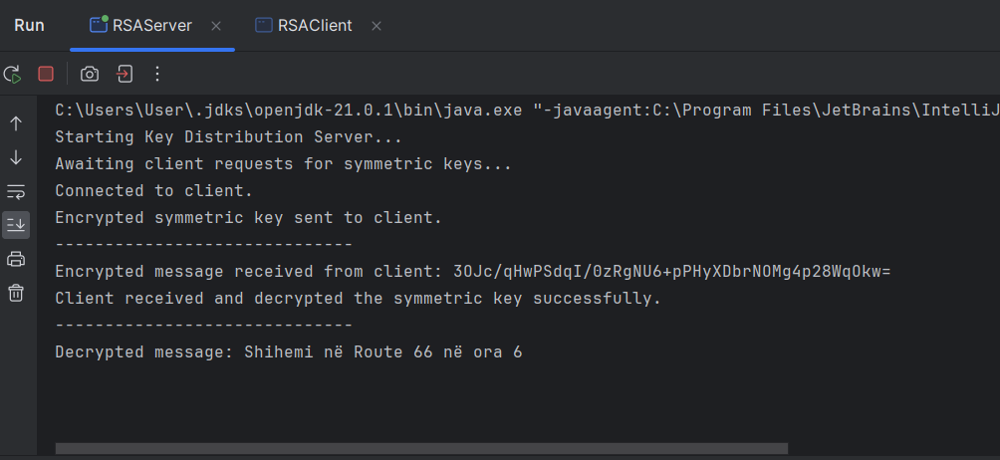

# Detyra e tretë nga lënda "Siguri e të Dhënave"

Ky projekt është një console aplikacion i cili shërben për komunikimin e sigurt të çelësit simetrik duke përdorur enkriptimin RSA. Komunikimi ndodhë mes një serveri dhe një klienti. Serveri gjeneron një çelës simetrik, e kodon atë me çelësin publik RSA të klientit dhe ia dërgon klientit. Klienti deshifron çelësin simetrik me çelësin e tij privat RSA dhe e përdor atë për komunikim të sigurt.

## Parakushtet

- Java Development Kit (JDK) të instaluar në sistemin tuaj
- Një IDE të përshtatshme të instaluar në kompjuterin tuaj

## Detajet e egzekutimit

1. **Clone the repository**:

   ```bash
   git clone https://github.com/lumii06/GR10_DataSecurity_Det3.git
2. **Navigoni për në direktoriumin e projektit**:

```bash
   cd GR10_DataSecurity_Det3
```
3. **Kompajlloni java files**:

```bash
   javac RSAServer.java RSAClient.java
```
4. **Run java files**:

```bash
java RSAServer
java RSAClient
```
## Përshkrim i programit

### Për RSAServer.java
1. Kodi është shkruar brenda një blloku try catch.
2. Bëhet inicializimi i serverit, duke krijuar "ServerSocket" në portin 12345.
3. Brenda një while true blloku kemi një bllok tjetër try ku në të bëhen veprimet si në vazhdim.
4. Gjenerohet key pair(çeëesi publik dhe privat) i RSA për serverin.
5. Bëhet pranimi i public key të klientit.
6. Gjenerohet çelësi simetrik AES me madhësinë 128.
7. Bëhet enkriptimi i çelësit simetrik me anë të çelësit publik të klientit.
8. Dërgohet çelësi simetrik i enkriptuar te klienti
9. Së fundmi bëhet pranimi i mesazhit të enkriptuar nga klienti, dekriptohet mesazhi dhe shfaet në console.
    
### Për RSAClient.java
// to be continued...


## Shembuj egzekutimi
### RSACLient


### RSAServer

